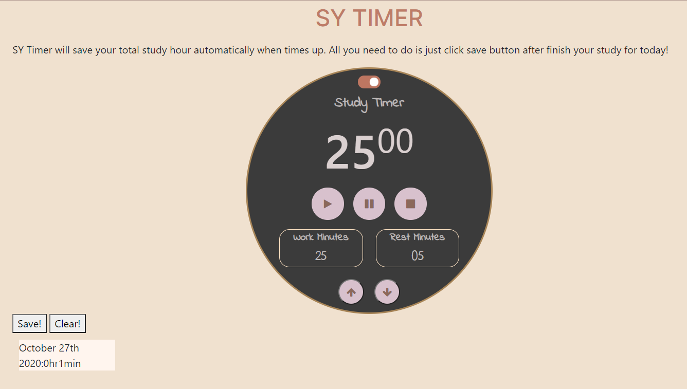

# First_Timer
## Description
Not every study goal should be 'todo list', it could be total study hours in a day. Most of timers are just functioning as a timer and users are using them just for time management. It is better to use timer with tracking total study hours for today. Set a goal such as "TODAY'S STUDY GOAL IS 10 HOURS". Use timer as regular timer app. Have a short break time or keep continue to study. Whenever the study is finished, just click 'save' button. It will automatically save the total study hour for today. 

## Table of Contents
* [URLs](#URLs)
* [Usage](#usage)
* [License](#license)

## URLs
1. Deployed URL
     https://songhee95.github.io/First_Timer/

2. Github Page URL
    [Github](https://github.com/Songhee95/First_Timer)

## Usage

## License
*MIT License*
Copyright (c) [2020] [SongheeYim]

Permission is hereby granted, free of charge, to any person obtaining a copy
of this software and associated documentation files (the "Software"), to deal
in the Software without restriction, including without limitation the rights
to use, copy, modify, merge, publish, distribute, sublicense, and/or sell
copies of the Software, and to permit persons to whom the Software is
furnished to do so, subject to the following conditions:

The above copyright notice and this permission notice shall be included in all
copies or substantial portions of the Software.

THE SOFTWARE IS PROVIDED "AS IS", WITHOUT WARRANTY OF ANY KIND, EXPRESS OR
IMPLIED, INCLUDING BUT NOT LIMITED TO THE WARRANTIES OF MERCHANTABILITY,
FITNESS FOR A PARTICULAR PURPOSE AND NONINFRINGEMENT. IN NO EVENT SHALL THE
AUTHORS OR COPYRIGHT HOLDERS BE LIABLE FOR ANY CLAIM, DAMAGES OR OTHER
LIABILITY, WHETHER IN AN ACTION OF CONTRACT, TORT OR OTHERWISE, ARISING FROM,
OUT OF OR IN CONNECTION WITH THE SOFTWARE OR THE USE OR OTHER DEALINGS IN THE
SOFTWARE.
